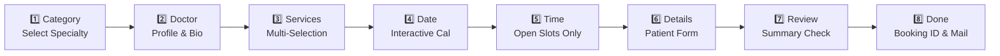

<div align="center">

# 🏥 Appointment Booking System for WordPress

**An enterprise-grade, multilingual, fully audit-logged booking engine built for healthcare — clinics, hospitals, dental practices, wellness centers, and multi-doctor facilities.**


[Why This Plugin](#why-this-plugin) • [Features](#-core-system-modules) • [Screenshots](#-screenshots) • [Installation](#-installation--quick-start) • [Database](#-database-architecture) • [Security](#-security--hardening) • [FAQ](#-faq) • [Roadmap](#-roadmap)

</div>

---

## Why This Plugin

Most WordPress booking plugins are built for salons and generic services. This one is purpose-built for healthcare: multi-doctor scheduling, per-doctor availability and holidays, treatment-category organization, and a patient-facing booking flow designed for clarity under stress someone booking a doctor's appointment isn't browsing, they're trying to get seen.

Every step of the wizard is deliberately minimal, every submission is re-validated server-side so two patients can never be double-booked into the same slot, and every admin action is logged so when a clinic manager asks "who changed this appointment and when," there's a real answer.

---

## ✨ Core System Modules

### 🧭 8-Step AJAX Booking Wizard
A responsive, no-reload booking journey that walks patients from specialty to confirmation:



| Step | Stage | What happens |
| :---: | :--- | :--- |
| **1** | **Category** | Patient picks a specialty — *Cardiology*, *Dental Care*, *Orthopedics*, or any category you define. |
| **2** | **Doctor** | Browse assigned doctors with photo, qualifications, experience, and bio. |
| **3** | **Services** | Select one or more services; total duration is calculated live. |
| **4** | **Date** | An interactive calendar respects each doctor's working days, holidays, and recurring days off. |
| **5** | **Time** | Slots are generated in real time, excluding breaks, past times, and anything already booked. |
| **6** | **Patient Info** | Collects name, email, phone, country code, and message — with inline validation. |
| **7** | **Review** | A summary card shows every selection before the patient commits. |
| **8** | **Confirmation** | A unique Booking ID (`AB-YYYYMMDD-XXXX`) is issued and a confirmation email is dispatched instantly. |

### 🌐 WPML & Multilingual Support
- Deep integration with WPML's language filters, so translated content and language switching work the way WordPress users expect.
- Multilingual admin screens and table columns activate automatically when WPML is present single-language sites stay clean and unaffected.
- Built-in dictionaries for **English**, **Spanish**, **German**, **French**, and **Arabic**, with full RTL layout support.
- A dedicated translation table stores translated doctor bios, service names, and category descriptions independently of core WordPress content.

### 🔤 Admin String Translation Suite
Found under **Appointment Booking → String Translations** a visual editor for every piece of static text in the plugin: step labels, buttons, form copy, alerts, and email templates. A live search box filters strings instantly as you type, and language tabs keep multi-locale editing organized.

### 🛡️ Activity & Audit Logs
Found under **Appointment Booking → Activity Logs** every administrative action is recorded with IP address, user agent, initiator role, and a field-level diff (old value vs. new, side by side). Logs also capture the exact rendered HTML of any email sent, and email delivery failures (SMTP errors, bad credentials, etc.) are logged too, so nothing fails silently. A raw JSON view is available for deeper technical auditing.

### 📧 Email Logs & Delivery Tracking
Every outbound email admin notifications, patient confirmations is logged with delivery status and a rendered preview. The plugin hooks into `wp_mail_failed`, so SMTP problems surface as an actionable log entry instead of a booking that quietly never got confirmed.

### 📊 Hardened CSV Export
One-click appointment exports with UTF-8 BOM encoding (so accented characters like `ä`, `é`, `ñ` render correctly in Excel) and protection against CSV formula injection.

### 🩺 Doctor Scheduling
Weekly working hours, break windows, configurable slot intervals, and holiday overrides (single date, date range, or recurring) all enforced live against the booking calendar.

---

## 🔒 Security & Hardening

> [!IMPORTANT]
> Built with the assumption that this handles real patient data. Treat every input as hostile until proven otherwise.

- **Nonces & capability checks** on every admin and AJAX request; destructive actions require `manage_options`.
- **`$wpdb->prepare()`** for all database queries no raw SQL interpolation.
- **Sanitization on input, escaping on output**, throughout.
- **Anti-formula CSV export (CWE-1236)** neutralizes leading `=`, `+`, `-`, `@`, tab, and carriage-return characters so a malicious cell can't execute code when opened in Excel.
- **Transient IP rate limiting** caps booking submissions at 5 per IP per 5 minutes to blunt automated bot flooding.
- **Honeypot field** on the public booking form for baseline spam prevention.
- **Server-side slot re-validation at submission time** the source of truth is the database, not the browser, so two patients can never claim the same slot.
- **Input length bounds** enforced server-side (`first_name`: 50, `last_name`: 50, `email`: 100, `phone`: 30, `message`: 1000).
- **Dedicated `class-security.php` and `class-validator.php`** modules centralize input handling rather than scattering ad hoc checks across controllers.

---

## 🗄️ Database Architecture

The plugin installs and maintains its schema via `dbDelta()` on activation:

| Table | Purpose |
| :--- | :--- |
| `wp_ab_categories` | Treatment categories and display order |
| `wp_ab_doctors` | Doctor profiles — qualifications, experience, email, bio |
| `wp_ab_doctor_categories` | Pivot: doctors ↔ categories (many-to-many) |
| `wp_ab_services` | Services, duration, category links |
| `wp_ab_availability` | Weekly working hours, breaks, slot duration per doctor |
| `wp_ab_holidays` | Single/range holidays, recurring days off, special working days |
| `wp_ab_appointments` | Master appointment records — status, patient data |
| `wp_ab_appointment_services` | Pivot: appointments ↔ selected services |
| `wp_ab_translation_map` | WPML translation mapping for custom table content |
| `wp_ab_activity_logs` | Audit trail — diffs, actor metadata, IP, user agent, email body |

**Uninstall:** by default, deleting the plugin drops all of the tables above. Turn on **Settings → Advanced → "Keep all appointment data when the plugin is deleted"** to preserve everything instead.

---

## 🏗️ Architecture Overview

The codebase follows a clear separation of concerns rather than one monolithic file:

```
appointment-booking-system/
├── admin/
│   ├── controllers/        # One controller per admin screen (doctors, services, activity logs...)
│   ├── views/partials/     # Renderable admin templates
│   └── class-admin.php
├── frontend/
│   ├── ajax/                # AJAX endpoint handlers
│   ├── shortcodes/           # [appointment_booking]
│   ├── views/                 # Public-facing booking form
│   └── class-frontend.php
├── includes/
│   ├── database/            # class-db-installer.php — schema creation
│   ├── email/                # class-email.php — dispatch + logging
│   ├── language/            # WPML adapter, translation service, i18n strings
│   ├── models/                # One model per entity (Doctor, Service, Appointment, Holiday...)
│   ├── security/             # class-security.php
│   ├── validation/           # class-validator.php
│   ├── class-logger.php
│   └── functions.php
├── assets/
│   ├── css/                  # admin.css, frontend.css
│   └── js/                   # admin.js, frontend.js
├── appointment-booking-system.php   # Bootstrap + PSR-4-ish autoloader
├── uninstall.php
└── readme.md
```

Classes are autoloaded from the `AB\` namespace, so `AB\Admin\Controllers\Doctor_Controller` maps directly to `admin/controllers/class-doctor-controller.php` no manual `require` list to maintain as the plugin grows.

---

## 💻 Page Builder Compatibility

Drop the shortcode into any page, post, or builder's code/text module:

```
[appointment_booking]
```

> [!TIP]
> Works with **Gutenberg**, **Divi Builder**, **Elementor**, **Beaver Builder**, and **WPBakery** the shortcode has zero dependency on any specific builder.

---

## 🚀 Installation & Quick Start

1. Upload the `appointment-booking-system` folder to `/wp-content/plugins/`.
2. Activate via **Plugins → Installed Plugins**.
3. Go to **Appointment Booking → Treatment Categories** and add your specialties.
4. Add **Doctors** and assign them to categories.
5. Add **Services** under each category.
6. Configure each doctor's **Availability** working hours, breaks, slot interval, holidays.
7. Drop `[appointment_booking]` onto your booking page. Done.

**Requirements:** WordPress 6.0+, PHP 8.1+, MySQL/MariaDB.

> [!NOTE]
> Confirmation emails rely on WordPress's `wp_mail()` (or your configured SMTP plugin). Verify your SMTP credentials under **Appointment Booking → Settings** and check **Activity Logs** for any `Email Delivery Failed` entries after your first test booking.

---

## ❓ FAQ

**Does this work with Elementor / Divi / other builders?**
Yes, the `[appointment_booking]` shortcode has no builder dependency and drops into any text/code/shortcode module.

**Can I run a bilingual or multilingual clinic site?**
Yes, with WPML installed. The plugin's translation layer covers categories, services, doctor bios, and every static UI string via the String Translations screen.

**What happens if two patients try to book the same slot at the same time?**
The server re-validates slot availability at submission time against the database, not just the browser state, so the second submission is rejected with an "already booked" response.

**Is patient data removed if I delete the plugin?**
By default, yes all custom tables are dropped on uninstall. Enable **Settings → Advanced → "Keep all appointment data when the plugin is deleted"** if you need to preserve records first.

**Where do I check if confirmation emails are actually sending?**
**Appointment Booking → Activity Logs**, filtered to `EMAIL` every send attempt, success or failure, is recorded with the SMTP error message if one occurred.

---

## 🔮 Future Plans

- 🗓️ Two-way Google Calendar & Outlook 365 sync
- 📹 Telehealth links via Zoom / Google Meet auto-generation
- 💬 WhatsApp & SMS reminders (Twilio / WhatsApp Business API)
- 💳 Payments Stripe, PayPal, Razorpay, WooCommerce checkout
- 👤 Patient portal self-service management and history
- 🔁 Rescheduling & recurring appointments
- 📈 Analytics dashboard
- 🔌 REST API
- 🧩 Native Elementor widget & Divi module

---

## 🤝 Contributing

Issues and pull requests are welcome. Please open an issue describing the bug or feature before submitting a PR so the approach can be discussed first.

## 📄 License & Credits

- **License:** GPL v2 or later
- **Author:** Aashish Pathak
- **Text Domain:** `appointment-booking-system`

---

<div align="center">

If this saves your clinic or your client's hours of admin work, a ⭐ on the repo goes a long way.

</div>
